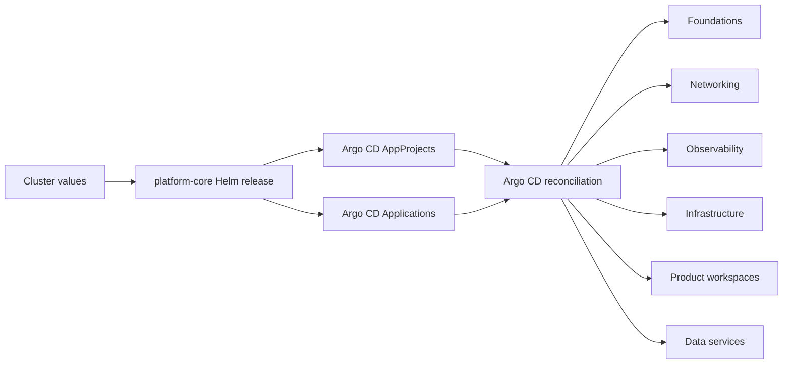

# platform-helm
A meta Helm chart that bootstraps the DramisInfo Kubernetes platform through Argo CD.
[](https://github.com/DramisInfo/platform-helm/actions/workflows/helm-lint.yaml) [](./LICENSE) [](https://github.com/DramisInfo/platform-helm/commits/main)

## Overview

`platform-helm` provides the `platform-core` chart used to establish a cluster's shared platform layer. It keeps component selection and cluster-specific settings in Helm values while delegating ongoing reconciliation to Argo CD.

## What this repo is

The chart renders Argo CD `Application` resources for platform services instead of installing those services directly. Argo CD then owns installation, upgrades, rollback, pruning, self-healing, and drift detection for components such as Gateway API, Gatekeeper, cert-manager, Crossplane, Istio, External Secrets Operator, CNPG, KEDA, NATS, and the monitoring stack.

`platform-core` also creates six `AppProject` boundaries for foundations, networking, observability, infrastructure, product workspaces, and data. Component templates are controlled by `bootstrap.*.enabled` values, use dependency-aware sync waves, and pin upstream chart or source revisions.

## Architecture



Helm bootstraps the desired Argo CD control-plane objects in the `argocd` namespace. Argo CD then fetches pinned upstream charts or Git sources and reconciles the downstream platform components into their target namespaces.

## Repository layout

```text
platform-helm/
├── platform-core/                 — The platform-core Helm chart
│   ├── Chart.yaml                 — Chart metadata and SemVer version
│   ├── values.yaml                — Cluster settings and component toggles
│   ├── GATEKEEPER-POLICIES.md     — Policy behavior and exclusions
│   ├── README.md                  — Grafana provisioning notes
│   └── templates/
│       ├── argo-applications/     — Argo CD Application templates by component
│       ├── argocd-projects.yaml   — Six platform AppProjects
│       └── platform-config.yaml   — Shared cluster identity ConfigMap
├── .github/                       — CI, release automation, prompts, and agents
├── CONTRIBUTING.md                — Development and pull-request guidance
├── SECURITY.md                    — Private vulnerability reporting process
└── LICENSE                        — MIT license
```

## Getting started

Prerequisites:

- Helm v3 (CI uses v3.14.4).
- A Kubernetes cluster with Argo CD already installed in the `argocd` namespace.
- A cluster-specific values file for identity and component overrides.

From a repository checkout, validate and install the chart:

```bash
helm lint platform-core
helm template platform-core ./platform-core -f my-values.yaml
helm install platform-core ./platform-core -n argocd -f my-values.yaml
```

## Usage

The most common task is rendering and applying a cluster-specific override. For example, start a Gatekeeper policy rollout in audit mode while keeping the Terraform Operator disabled:

```yaml
global:
  clusterName: "cace-1-dev"

bootstrap:
  terraformOperator:
    enabled: false
  gatekeeper:
    enabled: true
    policies:
      enabled: true
      enforcementAction: dryrun
```

Review the generated Argo CD resources before upgrading the release:

```bash
helm template platform-core ./platform-core -f my-values.yaml
helm upgrade --install platform-core ./platform-core \
  --namespace argocd \
  --values my-values.yaml
```

After validating policy behavior on the target cluster, change `enforcementAction` to `deny` and upgrade again.

## Configuration

The primary configuration surface is [`platform-core/values.yaml`](./platform-core/values.yaml).

| Value | Purpose |
| --- | --- |
| `global.clusterName` | Drives cluster-scoped names and `*.{cluster}.dramisinfo.com` hosts. |
| `global.azure` | Sets the Azure location, tenant ID, and subscription ID. |
| `bootstrap.<component>.enabled` | Includes or omits each component's Argo CD `Application`. |
| `bootstrap.crossplane.*Identity` | Controls Crossplane-managed workload identities for cert-manager and ESO. |
| `bootstrap.gatekeeper.policies` | Configures policy deployment, enforcement mode, exclusions, and exemptions. |
| `bootstrap.monitoring` | Enables Prometheus, Grafana, Loki, Tempo, and Beyla and configures storage or provisioning. |
| `bootstrap.nats.jetstream` / `gateway` | Configures persistence and optional multi-cluster NATS gateways. |
| `bootstrap.istio.host` | Sets the wildcard host used by the shared Istio gateway. |

Keep cluster overrides outside the chart defaults, and never put credentials or API tokens in values files.

## Related repos

- [home-lab](https://github.com/DramisInfo/home-lab) — Foundational infra and bootstrap orchestration for self-hosted k3s clusters on Proxmox + Azure.
- [platform-tools](https://github.com/DramisInfo/platform-tools) — GitOps overlays for the DramisInfo platform clusters.
- [platform-helm](https://github.com/DramisInfo/platform-helm) — Meta Helm chart (`platform-core`) for Argo CD-driven platform bootstrap.
- [platform-crossplane-compositions](https://github.com/DramisInfo/platform-crossplane-compositions) — Crossplane Compositions (XRDs, compositions, RBAC) for the platform.
- [crossplane-providers-and-functions](https://github.com/DramisInfo/crossplane-providers-and-functions) — Helm chart that installs the Crossplane providers, composition functions, and ProviderConfigs.
- [platform-project-workspaces](https://github.com/DramisInfo/platform-project-workspaces) — Bootstrap manifests for the product-workspaces App-of-Apps pattern and the preview/QAS GitHub repository_dispatch pipeline.
- [platform-standards](https://github.com/DramisInfo/platform-standards) — Canonical schemas and conventions for product workspaces and app repositories.
- [platform-workflows](https://github.com/DramisInfo/platform-workflows) — Reusable GitHub Actions workflows for the DramisInfo org.

## Troubleshooting

- **Helm reports an unknown `Application` kind:** install Argo CD and its CRDs before installing `platform-core`.
- **A component does not render:** verify its exact case-sensitive `bootstrap.<component>.enabled` key; observability components share `bootstrap.monitoring.enabled`.
- **An Argo CD app stays OutOfSync or unhealthy:** inspect its AppProject, pinned source revision, destination namespace, and preceding sync-wave applications.
- **Gatekeeper blocks a new workload:** add the required non-root security context, dropped capabilities, and `RuntimeDefault` seccomp profile; use `dryrun` while validating policy changes.
- **A first bootstrap fails on a missing CRD:** confirm Gateway API and Crossplane composition applications completed before dependent applications, then resync in wave order.

## Security

- Do not store secrets, tokens, or credentials in `values.yaml`; use External Secrets Operator and the shared Azure Key Vault integration.
- Pin every `targetRevision` to an exact chart version or commit, never `latest` or a floating branch.
- Do not widen `hermes-sre-readonly`: it must not gain secret access, write verbs, wildcard rules, or `pods/exec`.
- Test Gatekeeper policy changes with `bootstrap.gatekeeper.policies.enforcementAction: dryrun` before enforcing `deny`.
- Keep `bootstrap.terraformOperator` disabled by default and opt in per cluster.
- Do not manually edit generated `.github/workflows/*.lock.yml` files.
- Report vulnerabilities privately as described in [`SECURITY.md`](./SECURITY.md), not through public issues.

## Contributing

Create a focused branch from `main`, use Conventional Commits, and open a pull request back to `main`. Run `helm lint platform-core` and `helm template platform-core ./platform-core` before submitting. Chart changes must update value comments where needed and bump `platform-core/Chart.yaml` according to SemVer; see [`CONTRIBUTING.md`](./CONTRIBUTING.md).

## License

MIT — see [LICENSE](./LICENSE)

## Changelog

Major changes have expanded `platform-core` with Gateway API-based ingress, Crossplane-managed workload identities, observability and data services, policy hardening, load-testing and event components, and read-only investigation RBAC. Dependency and chart-version updates are maintained continuously; run `git log --oneline` for the complete history.

## Acknowledgments

Maintained by DramisInfo platform contributors and built around Kubernetes, Helm, Argo CD, Crossplane, and the upstream projects installed by the chart.
