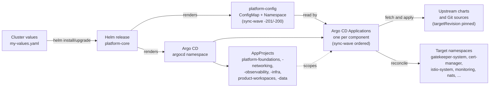
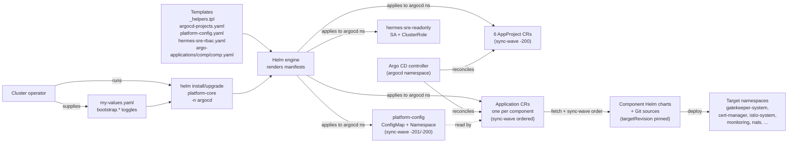
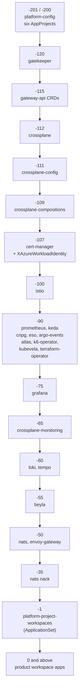
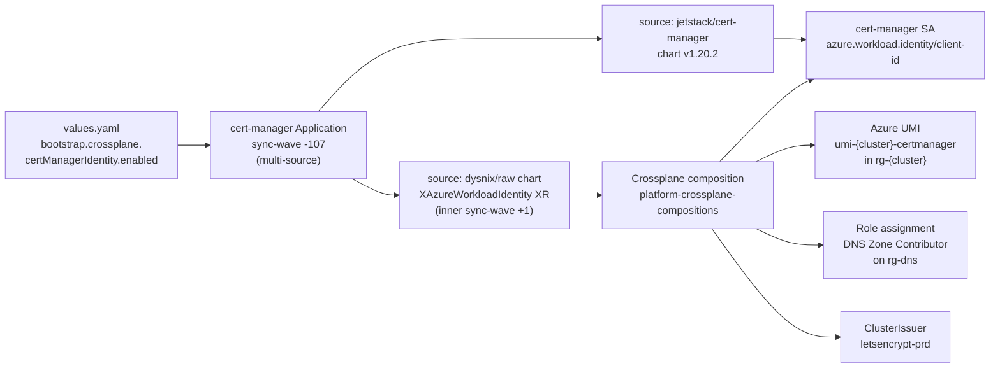

# Architecture

`platform-core` is intentionally thin at runtime. It runs once per
cluster bootstrap (and once per `helm upgrade`) and renders Argo CD
control-plane objects. After that, Argo CD is the source of truth for
the platform layer.

## Layered view

The chart does not deploy Gateway API, cert-manager, Crossplane, or
Istio directly. It renders `Application` and `AppProject` CRDs into
the `argocd` namespace. Argo CD then reconciles those CRDs and
deploys the real workloads into their target namespaces.

The diagram makes the chart's role explicit: `platform-core` is a
factory for Argo CD objects. After `helm install`, all real lifecycle
work happens inside Argo CD.

## Helm release flow

The `helm install/upgrade` of `platform-core` is a one-shot factory
run, not a long-running controller. Helm renders the templates, ships
the resulting manifests to the `argocd` namespace, and then exits.
Argo CD's controller loop is what reconciles those objects
continuously afterward.

The diagram separates the two phases: Helm renders once on the left
into Argo CD objects; Argo CD's controller takes over on the right
and reconciles everything from there. Re-running `helm upgrade`
re-renders and re-applies only the chart's own objects; it does not
touch the downstream component charts that Argo CD owns.

## AppProjects

`templates/argocd-projects.yaml` defines six platform AppProjects,
each pinned to `argocd.argoproj.io/sync-wave: "-200"` so they are
created before the Applications they scope:

- `platform-foundations` — security, policy, CRD bootstrapping, secret
  management. Apps: `gateway-api`, `gatekeeper`, `cert-manager`,
  `external-secret-operator`, `argo-events`.
- `platform-networking` — service mesh, ingress, and API gateways.
  Apps: `istio`, `envoy-gateway`.
- `platform-observability` — metrics, logs, traces, dashboards, and
  service-mesh observability. Apps: `prometheus`, `grafana`, `loki`,
  `tempo`, `beyla`.
- `platform-infra` — workload execution, scaling, data and event
  plumbing. Apps: `keda`, `nats`, `cnpg`, `atlas`,
  `terraform-operator`, `kubevela`, `k6-operator`.
- `platform-product-workspaces` — discover `XProductWorkspace`
  claims from `https://github.com/DramisInfo/*-workspace.git` via
  ApplicationSet.
- `platform-data` — Crossplane Compositions and provider plumbing,
  installed alongside Crossplane.

## Sync waves

Component templates set `argocd.argoproj.io/sync-wave` annotations to
order reconciliation. The waterfall below shows the actual wave
ordering in use today (negative waves reconcile earlier, positive
later).

When adding a new component, place it on a wave between its CRD
providers and its consumers. Negative waves reconcile earlier, so a
new CRD-providing component belongs before any component that
consumes those CRDs.

## Cluster identity

`templates/platform-config.yaml` renders a ConfigMap (and Namespace)
that downstream Argo CD Applications read for shared cluster identity:
cluster name, Azure tenant / subscription / location, the
`*.{cluster}.dramisinfo.com` host template, and related defaults.
This avoids re-passing cluster identity through every Application's
values.

`global.clusterName` drives:

- the wildcard host (`bootstrap.istio.host` resolves to
  `*.{{ .Values.global.clusterName }}.dramisinfo.com` by default);
- Azure resource naming (e.g. `rg-{clusterName}`,
  `umi-{clusterName}-certmanager`);
- NATS JetStream domain defaults when gateways are enabled;
- the default Grafana TLS secret name
  (`envoy-gateway-tls-{clusterName}`).

## Crossplane-managed identities

The chart does not provision workload identities directly. Instead:

- The cert-manager user-assigned managed identity is created by
  Crossplane (composition in `platform-crossplane-compositions`)
  when `bootstrap.crossplane.certManagerIdentity.enabled` is set to
  true via a cluster overlay patch. The cert-manager Application
  template picks up the resulting client ID.
- The External Secrets Operator identity and ClusterSecretStore are
  similarly provisioned by Crossplane via
  `bootstrap.crossplane.esoIdentity`. The shared Key Vault is
  `akv-dramisinfo-shared`.

This keeps cluster-bootstrap concerns out of Helm and lets
Crossplane handle the Azure-side lifecycle. The cert-manager
Application uses a multi-source Argo CD pattern to ship the Helm
chart and the `XAzureWorkloadIdentity` XR together:

The inner sync-wave `+1` on the `XAzureWorkloadIdentity` source
ensures the cert-manager Deployment exists before the composition
patches it. The parent's wave `-107` follows crossplane-compositions
at `-109`, so the XRD CRD is guaranteed to exist by the time the XR
is applied.

## Read-only investigation RBAC

`templates/hermes-sre-rbac.yaml` renders a `hermes-sre-readonly`
ServiceAccount plus ClusterRole, intended for autonomous agent
sandboxes to investigate Argo CD and Crossplane status without write
access. The role is intentionally narrow (pods, logs, events, nodes,
Argo CD / Crossplane status). It must not be widened — no secrets, no
write verbs, no `pods/exec`, no wildcard rules.

## Gatekeeper posture

Gatekeeper runs in `enforcementAction: deny` by default for the
included policy library. Component templates add the required
security context to satisfy the library: `runAsNonRoot: true`,
`allowPrivilegeEscalation: false`, `capabilities.drop: [ALL]`,
`seccompProfile.type: RuntimeDefault`. Switch to `dryrun` while
validating a new policy or a new workload on the target cluster, then
flip back to `deny`.

## Argo CD itself is assumed

The chart does not install Argo CD. Argo CD is expected to already
exist in the `argocd` namespace on the target cluster, and
`platform-core` is installed into that same namespace.
